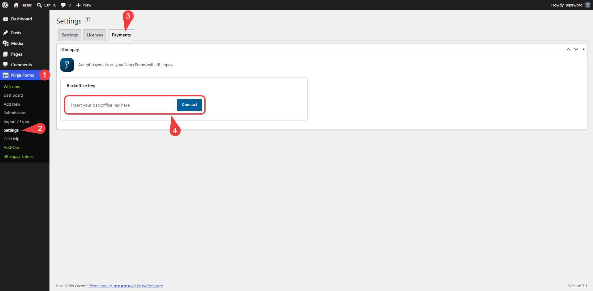
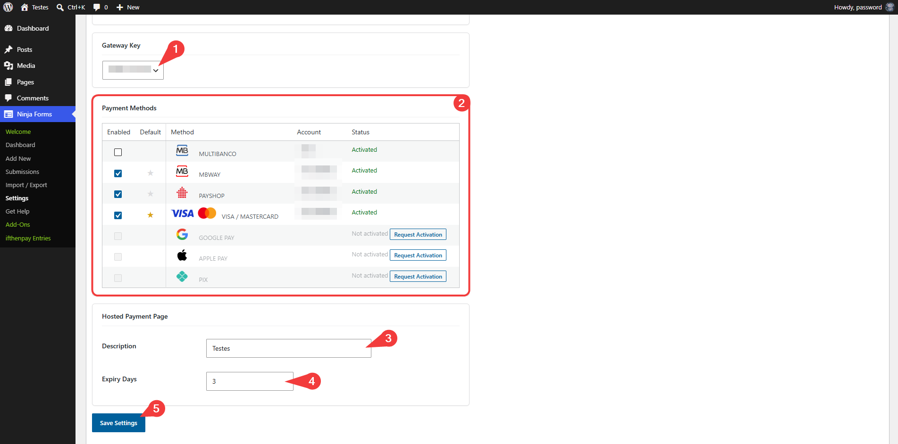
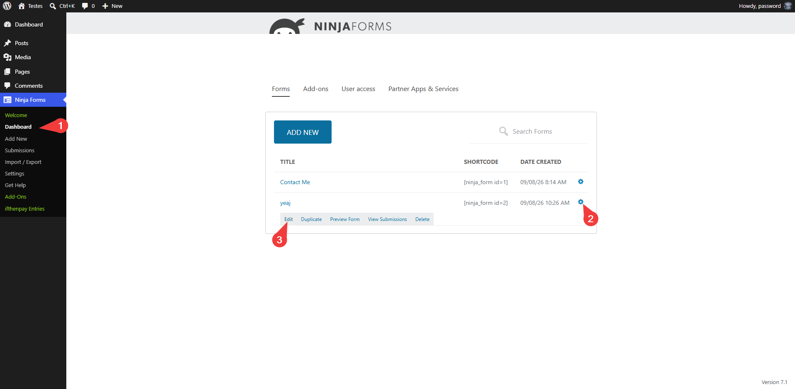
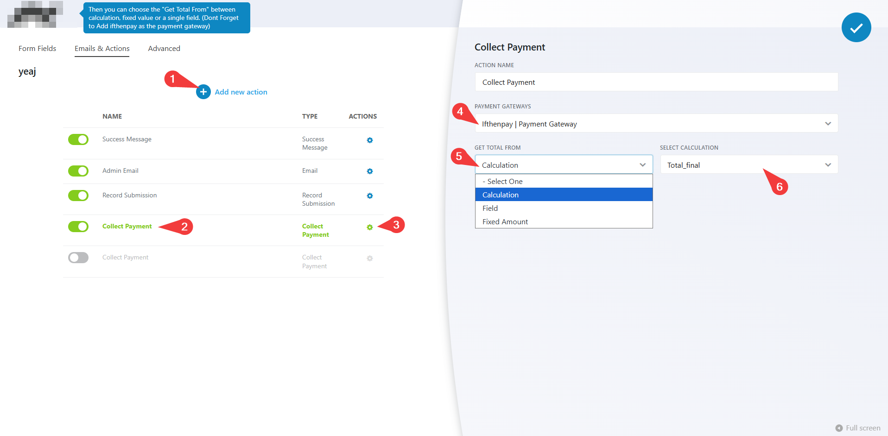
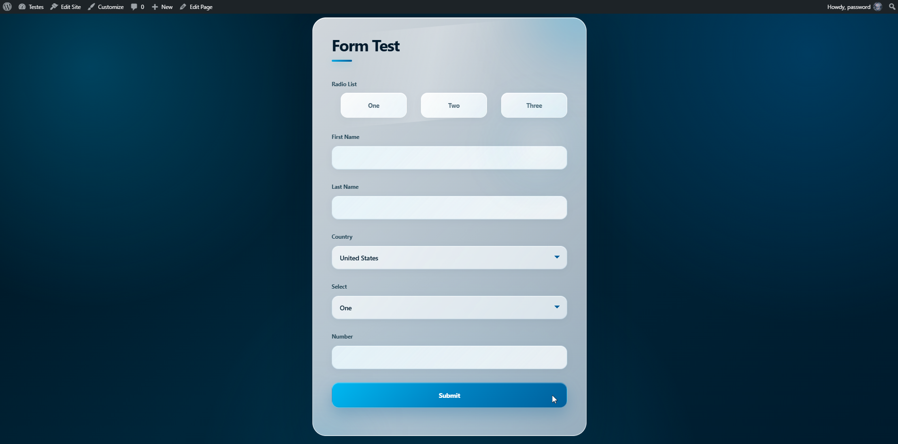
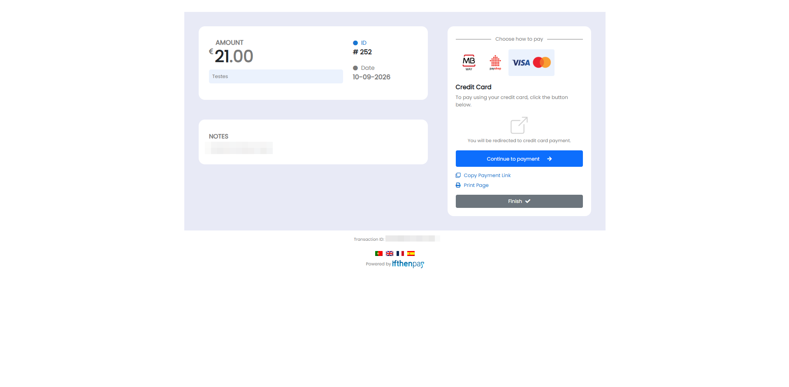
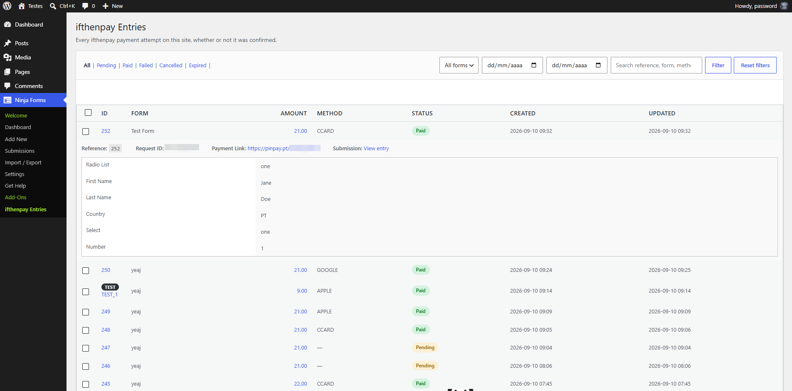

# ifthenpay | Payments for Ninja Forms

Adds ifthenpay payment methods to Ninja Forms: cards, wallets, and local payment options; supports secure one-time payments via pay-by-link.

---

## Table of Contents

- [Description](#user-content-en-description)
- [Key Features](#user-content-en-key-features)
- [Requirements](#user-content-en-requirements)
- [Installation](#user-content-en-installation)
- [Frequently Asked Questions](#user-content-en-frequently-asked-questions)
- [External Services](#user-content-en-external-services)
- [Screenshots](#user-content-en-screenshots)
- [Support](#user-content-en-support)

### Description

This plugin integrates the ifthenpay payment gateway with Ninja Forms to enable seamless payment collection directly from your forms. Payments are processed through a secure pay-by-link system, ensuring that no sensitive card or banking data is stored on your website. Customers can complete payments using their preferred method via a secure payment page. After submitting a form, users are redirected to ifthenpay's secure hosted payment page to complete the transaction; ifthenpay then sends a server-side callback to update the payment status automatically.

**In plain terms you get:**

- One-time payments directly from Ninja Forms
- Support for coupons and automatic total calculations
- Merchant backoffice (basic sales) on web + mobile
- Secure automatic payment confirmations (no card numbers stored)

All settings are made in Ninja Forms and in your ifthenpay Backoffice. The plugin is built so site owners can manage payments without needing deep technical knowledge.

### Key Features

1. Full integration with Ninja Forms Lite and Pro payment flow
2. Secure transactions
3. Automatic payment confirmation
4. Support for multiple payment methods (cards, wallets, transfers)
5. Coupon and discount support via Ninja Forms
6. Secure full-page redirect to ifthenpay's hosted payment page
7. Real-time payment status in Ninja Forms entries
8. Multi-language support (EN, ES, FR, PT)
9. Security first (no card data stored)

### Requirements

- An active ifthenpay merchant account — [subscribe here](https://ifthenpay.com/aderir/) to obtain your credentials.
- A Ninja Forms Gateway Key (request this from ifthenpay support/helpdesk).
- The payment methods you want enabled on that Gateway Key (our helpdesk team will guide you).
- WordPress 6.5+ and PHP 8.2+, and Ninja Forms installed and activated.
- HTTPS (SSL) enabled on your site.

### Installation

1. **Install:** Upload the plugin zip via `Plugins → Add New → Upload`, or install from WordPress.org and Activate.
2. **Credentials:** Ensure your ifthenpay account has an active Ninja Forms Gateway Key with the desired payment methods enabled.
3. **Setup Part1:** Go to `Ninja Forms → Settings → Payments → ifthenpay` and enter your Backoffice Key.
4. **Setup Part2:** After the backoffice key is connected you'll be presented with the gateway key configurations, select your gateway key of choice if you have more than one with ninja forms context, enable your favorite methods, set a default payment method, description for your payments and a expire date for your pay by links.
4. **Form config:** `Create/Edit a form → Payments tab → Add the Ifthenpay field on your form → enable "ifthenpay | Payment Gateway"` and select a Gateway Key. Next, choose which payment methods to activate from those available in your gateway, and set your default payment method. Finally, add a payment description, which will be displayed on the ifthenpay payment page for all transactions.

### Frequently Asked Questions

<strong>Does this plugin require Ninja Forms?</strong>

Yes. Ninja Forms must be installed and active to use this plugin.

<strong>Does it support recurring payments?</strong>

No. This version supports only one-time payments via pay-by-link.

<strong>Are payment details stored?</strong>

No. The plugin does not store card numbers or full bank details. Only minimal references required for payment matching are kept.

<strong>Which payment methods are supported?</strong>

Any ifthenpay method attached to your Gateway Key (e.g. Multibanco, MB WAY, Payshop, Credit Card, Google Pay, Apple Pay, Pix).

<strong>How does the payment process work?</strong>

After form submission, users are redirected to a secure ifthenpay-hosted payment page. Once payment is completed, the status is updated automatically via callback and the user will be shown a Thank you confirmation.

<strong>What happens if a payment fails?</strong>

The entry is marked as Failed.

<strong>Is there a sandbox?</strong>

ifthenpay may provide test entities; if unavailable, use a low-value live test.

<strong>How secure is the integration?</strong>

Requests are encrypted over HTTPS; no sensitive payment data is stored.

<strong>Does ifthenpay's addon for Ninja Forms accept webhooks(Callbacks)?</strong>

Yes! ifthenpay's addon for Ninja Forms accepts webhooks(callbacks).

### External Services

This plugin integrates with the ifthenpay payment platform to process payments for Ninja Forms submissions. ifthenpay is a third-party service that provides secure payment processing for cards, wallets, and local bank transfers.

- **Ninja Forms**
  - **What it is and what it is used for**: A form builder plugin used to create payment forms. This plugin extends its payment capabilities.

- **ifthenpay Backoffice & Integrations**
  - **What it is and what it is used for**: The ifthenpay Backoffice is the merchant dashboard used to manage integrations and payment configurations. The plugin uses the ifthenpay API to generate payment links and validate transactions.
  - **What data is sent and when**:
    - During setup: Backoffice Key and Gateway Key for authentication and configuration retrieval.
    - During payment processing: Order reference ID, amount, description, enabled payment method accounts, success/error/cancel return URLs, language, and optionally the selected payment method, customer email, customer name, and form field data.
    - During webhook registration: the Gateway Key and this site's callback URL, so ifthenpay can notify the site directly when a payment resolves.
    - During payment method activation requests: when an admin requests activation of a new payment method from `Ninja Forms → Settings → Payments`, an email is sent to ifthenpay support (suporte@ifthenpay.com) containing the Backoffice Key, Gateway Key, the requested payment method, the admin's email address, site URL, site name, WordPress version, Ninja Forms version, and plugin version.
    - During callbacks: Payment status and payment method.
  - **End-User License Agreement (EULA)**: [EULA](https://ifthenpay.com/eula/)
  - **Privacy Policy**: [Privacy Policy](https://ifthenpay.com/politica-de-privacidade/)

All network requests are performed server-side over HTTPS. Sensitive credentials are stored securely and are not publicly exposed. No raw card or bank details are stored.

### Screenshots

Below are screenshots demonstrating key features and interfaces of the plugin:

1. **(Admin Only) Backoffice Synchronization under Ninja Forms Settings Payments**
   
2. **(Admin Only) Ninja Forms's Gateway Configuration**
   
3. **(Admin Only) Edit a Form**
   
4. **(Admin Only) Form Advanced Calculations Setting**
   
5. **(Admin Only) Form Email & Actions settings, Collect Payment Settings**
   
6. **(Customers Experience) Payment Form**
   
7. **(Customers Experience) ifthenpay Payment Gateway Secure Payment Page**
   
8. **(Admin Only) Payment Entries**
   

### Support

For assistance use the [WordPress.org support forum](https://wordpress.org/support):

Pre-checks:

- Payment method enabled on Gateway Key AND mapped to Integration
- Running current recommended versions of WordPress, PHP, & Ninja Forms

Commercial helpdesk available (no direct email required): [helpdesk.ifthenpay.com](https://helpdesk.ifthenpay.com/)

- **ifthenpay support**: [suporte@ifthenpay.com](mailto:suporte@ifthenpay.com)
- **Ninja Forms docs**: [Ninja Forms docs](https://ninjaforms.com/docs/)

